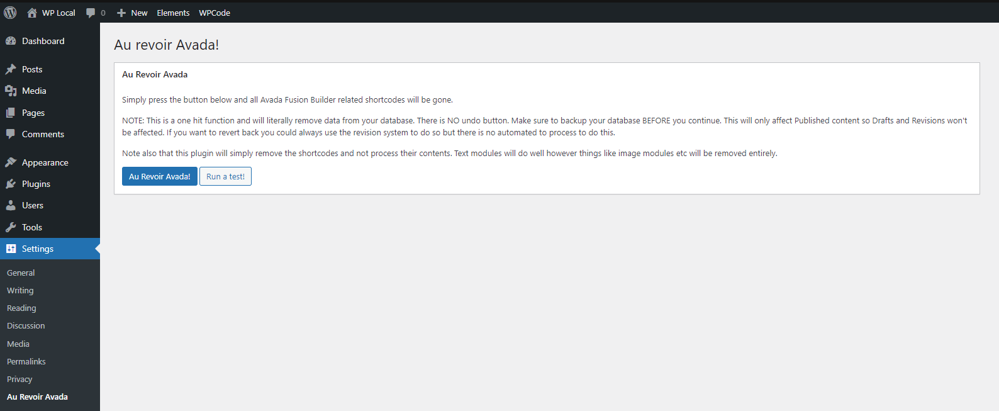

# Au Revoir Avada

## Wordpress plugin for removing Avada Fusion Builder shortcodes from pages/posts
Based on the "Bye Bye Divi!" plugin by [Sean Barton](https://www.sean-barton.co.uk/2017/12/bye-bye-divi/)

### Installation
To install the Au Revoir Avada plugin, simply copy the au_revoir_avada.php file to your plugin directory or ZIP up the file and upload it through the "Add Plugin" tool within the WordPress plugins page.

When installed, the tool can be found in "Settings" > "Au Revoir Avada".

!important - make sure you backup your database before committing any final changes to ensure there is no data loss - use of this plugin is at your own risk.

## Changelog

### 07/11/2023
Initial Build